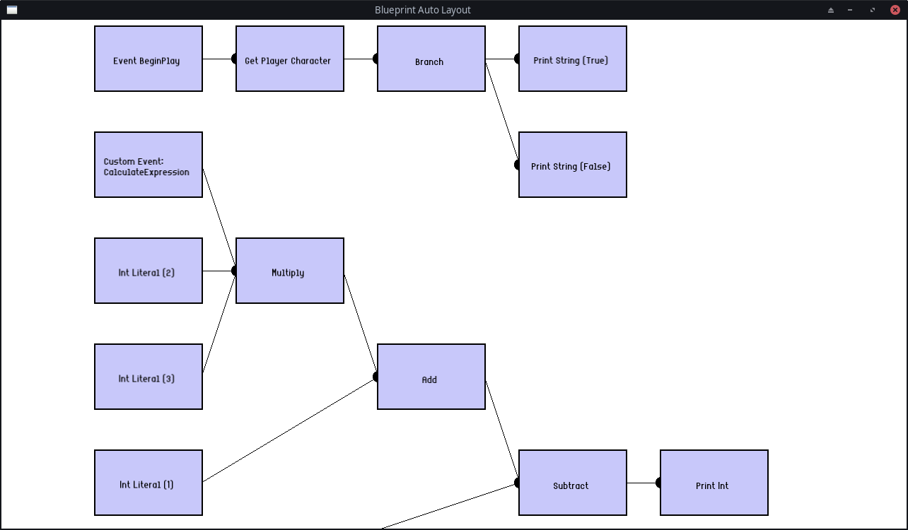

# BlueprintAutoLayout

Rozwiązanie wykorzystuje niepełną, zaimplementowaną intuicyjnie metodę Sugiyamy do rysowania warstwowego grafu.
Implementacja nie zawiera w sobie niwelowania przecięć.

Dla prostszej wizualizacji zastosowano bibliotekę SFML, która jest pobierania przez `FetchContent`
(konieczny jest `git` na urządzeniu).

Aplikacja była kompilowana i uruchamiana w następujących konfiguracjach:
- Windows 11, MinGW 11.0, g++ 13.1.0
- Manjaro Linux, g++ 15.2.1

Inne konfiguracje (np. z MSVC) nie były sprawdzane.

## Przykładowe działanie:

Poniższy zrzut ekranu przedstawia auto-layout dla własnych danych z pliku [blueprint.json](blueprint.json).

