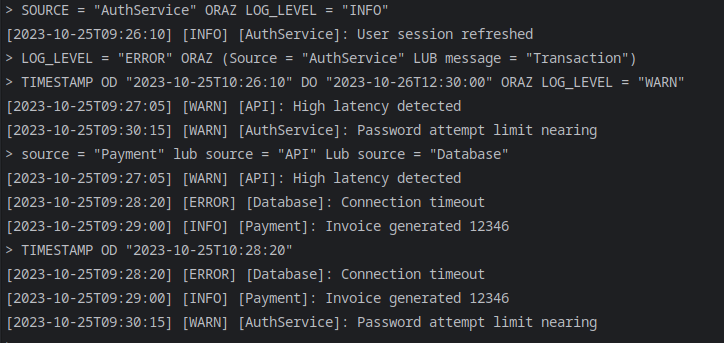

# Log Analyzer

Analizator bazuje na recursive descent parserze.

Obsługiwane słowa kluczowe:
- TIMESTAMP
- SOURCE
- LOG_LEVEL
- MESSAGE
- ORAZ
- LUB
- OD
- DO
- =
- !=
- (
- )

Spacje w zapytaniach są ignorowane, wielkość znaków jest ignorowana tylko dla słów kluczowych.

Aplikacja była kompilowana i uruchamiana w następujących konfiguracjach:
- Manjaro Linux, g++ 15.2.1

Inne konfiguracje (np. Windows czy kompilator MSVC) nie były sprawdzane.

W przypadku konsoli w CLion logi nie wyświetlają się poprawnie; w edycji konfiguracji należy zaznaczyć
`Emulate terminal in the output console`. Zwykła konsola działa poprawnie.

Przeprowadzone testy nie są typowymi, dokładnymi testami jednostkowymi; nie testują również wszystkich komponentów
rozwiązania, lecz tylko parsowanie i ewaluację zapytań.

## Przykładowe zapytania:
```
SOURCE = "AuthService" ORAZ LOG_LEVEL = "INFO"

LOG_LEVEL = "ERROR" ORAZ (Source = "AuthService" LUB message = "Transaction")

TIMESTAMP OD "2023-10-25T10:26:10" DO "2023-10-26T12:30:00" ORAZ LOG_LEVEL = "WARN"

source = "Payment" lub source = "API" Lub source = "Database"

TIMESTAMP OD "2023-10-25T10:28:20"
```

W przypadku ostatniego zapytania zwrócone zostaną wszystkie logi do chwili obecnej.


## Przykładowe działanie:
Dla logów:
```
[2023-10-25T10:26:10] [INFO] [AuthService] User session refreshed
[2023-10-25T10:27:05] [WARN] [API] High latency detected
[2023-10-25T10:28:20] [ERROR] [Database] Connection timeout
[2023-10-25T10:29:00] [INFO] [Payment] Invoice generated 12346
[2023-10-25T10:30:15] [WARN] [AuthService] Password attempt limit nearing
```


