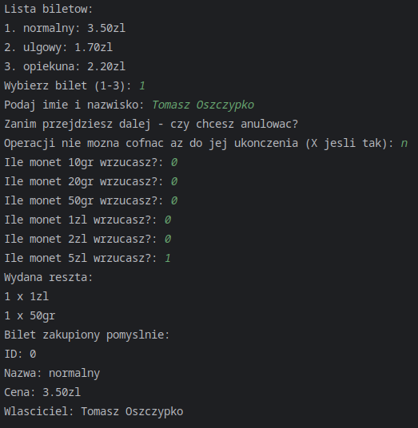
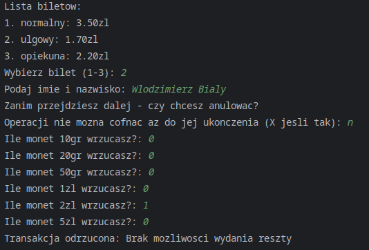

# TicketMachine

Przedstawione rozwiązanie wykorzystuje jednego klienta (dla umożlwienia pracy z terminalem).
Metody serwera zabezpieczone są muteksem dla uniemożliwienia dostępu do tego samego zasobu przez dwóch użytkowników
jednocześnie w przyszłości. Dodatkowo, serwer tworzy osobny wątek sprawdzający co sekundę trwające rezerwacje - w
przypadku rezerwacji trwającej dłużej niż 60 sekund klient przerywa działanie po następnym etapie inputów.

Przeprowadzone testy nie są typowymi, dokładnymi testami jednostkowymi; nie testują również wszystkich komponentów
rozwiązania, lecz tylko CashRegister pod kątem poprawności wydawania reszty.

Aplikacja była uruchamiana w następujących konfiguracjach:
- Windows 11, MinGW 11.0, g++ 13.1.0
- Manjaro Linux, g++ 15.2.1

Inne konfiguracje (np. z MSVC) nie były sprawdzane. 

Domyślnie automat posiada po 10 monet każdego nominału - aby to zmienić należy ręcznie zmodyfikować plik main.cpp.

## Przykładowe działanie:

### Pomyślny zakup biletu (automat zawiera po 10 monet każdego nominału):

### Brak możliwości wydania reszty:

